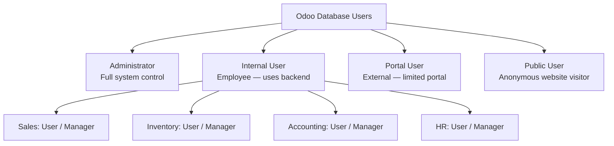
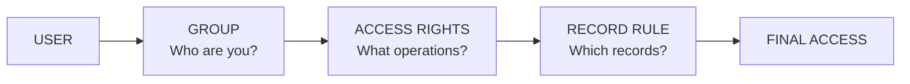
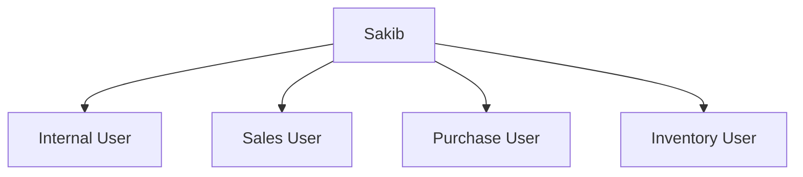
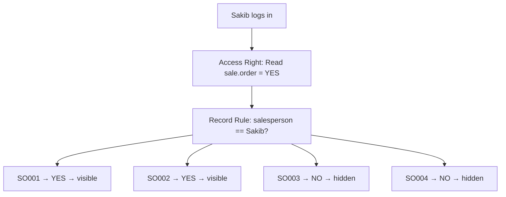
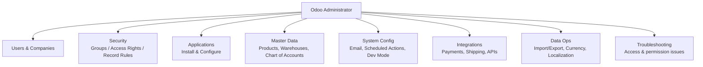
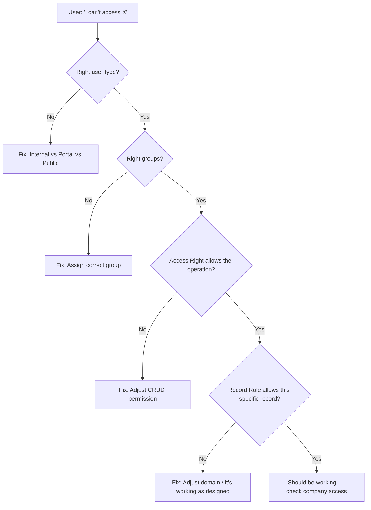

# Odoo Notes — User Types & Security Model

> **Big idea to hold onto before anything else:**
> `Administrator / Manager / Internal User / Portal User` = **who someone is (a role)**.
> `Groups / Access Rights / Record Rules` = **the machinery Odoo uses to decide what that role can actually do.**
> Keep these two buckets separate in your head and everything below becomes easy.

---

## 1. The Big Picture — User Types



**Key correction to the "3 power levels" idea:** Odoo doesn't hard-code 3 internal power tiers. It hard-codes a **User Type** (Internal / Portal / Public), and then layers **Groups** on top to decide the actual power. Two "Internal Users" can have completely different permissions depending on their groups.

| User Type | Logs in? | Sees backend? | Company employee? | Typical access |
|---|---|---|---|---|
| **Administrator** | ✓ | ✓ | Usually | Almost everything |
| **Internal User** | ✓ | ✓ | ✓ | Depends entirely on groups |
| **Portal User** | ✓ | Limited portal only | Usually no | Only their own business docs |
| **Public User** | ✗ | ✗ | No | Public website content only |

```
                POWER (loosely)
                    ↑
             Administrator
                    │
             Internal Users
                    │
              Portal Users
                    │
              Public Users
                    ↓
                  LESS
```
*(Loosely — because an Internal User's real power depends on groups, not the label "Internal.")*

### 1.1 Internal User
Anyone working *inside* the company: salesperson, accountant, warehouse staff, HR, purchase officer, manager, admin. They log into the normal Odoo backend — but **what they can touch depends on their groups**, not on being "internal."

- Employee A → Sales User → can create quotations, manage customers, view sales orders — **cannot** touch accounting config or manage users.
- Employee B → Inventory Manager → can manage warehouses, validate transfers, configure inventory — a totally different power set, same "Internal User" type.

### 1.2 Portal User (the "external user" you mentioned)
Customers, vendors, clients — people outside the org who need to see *their own* records only (their quotations, orders, invoices, deliveries). They never get the full backend. Exact capabilities depend on which portal features are enabled.

### 1.3 Public User
Someone browsing the *website* with no login at all — can view products/pages, maybe submit a form or add to cart, but has zero access to private company data.

### 1.4 Administrator / Super Admin
The person who configures the whole system: users, companies, modules, security, technical settings. (Note: **Administrator ≠ technical Superuser** — Administrator is a very privileged *normal* account; Superuser is a lower-level mechanism that bypasses some checks.)

---

## 2. The Security Engine: Group → Access Rights → Record Rules

This is the part worth mastering cold — it's what actually decides what any Internal User can do.



| Layer | Question it answers | Example |
|---|---|---|
| **Group** | *What role do you have?* | "Sales User", "Inventory Manager" |
| **Access Rights** | *Can you Read / Create / Write / Delete this **type** of record (this model)?* | Sales User → `sale.order` → Read✓ Create✓ Write✓ Delete✗ |
| **Record Rule** | *Of the records you're allowed to touch, **which specific ones**?* | "Only orders where salesperson = me" |

> **Teaching analogy — a bank:**
> - **Group** = "You are a bank employee."
> - **Access Rights** = "You may read and update customer accounts."
> - **Record Rule** = "…but only accounts belonging to *your branch*."

> **Teaching analogy — a building:**
> - **Access Rights** = does this person have permission to enter *this type* of room?
> - **Record Rule** = *which specific rooms* can they enter?

### 2.1 Groups — "Who are you?"
A Group is a role label: `Sales User`, `Sales Manager`, `Inventory User`, `Inventory Administrator`, etc. A user can belong to **several groups at once**, and their real permissions are the *combination* of all of them.



This is *why* Odoo scales to big companies — instead of one giant role like `SUPER-SALES-INVENTORY-ACCOUNTING-USER`, you assemble permissions from small reusable groups.

### 2.2 Access Rights — "What can this group do?"
Four basic CRUD permissions, defined **per model** (a model = a type of business data, e.g. `sale.order`, `res.partner`, `stock.picking`).

| Permission | Meaning |
|---|---|
| Read | Can view |
| Create | Can create new records |
| Write | Can edit existing records |
| Delete | Can delete records |

**Example — `sale.order` for a Sales User:**

| Role | Read | Create | Write | Delete |
|---|:---:|:---:|:---:|:---:|
| Sales User | ✓ | ✓ | ✓ | ✗ |
| Sales Manager | ✓ | ✓ | ✓ | ✓ |

> Technically these live in a file called **`ir.model.access.csv`**. A row like `access_sales_user, sale.order.user, model_sale_order, sales_group, 1,1,1,0` — the four trailing numbers are `read, write, create, delete` in that order (careful: order in the CSV isn't the same order as "CRUD"!).

### 2.3 Record Rules — "Which records, specifically?"
Access Rights only tell you if you can touch the *model* at all. Record Rules filter *which rows*. Defined technically via `<record model="ir.rule">` with a domain, e.g. `[('user_id','=',user.id)]`.

**Worked example — ABC Electronics Sales data:**

| Order | Salesperson | Customer | Amount |
|---|---|---|---|
| SO001 | Sakib | A Ltd | $500 |
| SO002 | Sakib | B Ltd | $800 |
| SO003 | Rahim | C Ltd | $1,200 |
| SO004 | Rahim | D Ltd | $900 |

Rule: *"Sales User can access `sale.order` only where salesperson = current user."*



Meanwhile **Sales Manager (Karim)** has the same Access Rights but a broader/no restricting Record Rule → sees **all four** orders, and (per his Access Rights) can also delete them.

### 2.4 Case-by-case logic (this is the part interviewers love to test)

| Action | Access Right check | Record Rule check | Result |
|---|---|---|---|
| Sakib views SO001 (his own) | Read = ✓ | belongs to Sakib = ✓ | ✅ Allowed |
| Sakib views SO003 (Rahim's) | Read = ✓ | belongs to Sakib = ✗ | ❌ Denied (record rule blocks it) |
| Sakib edits SO001 | Write = ✓ | belongs to Sakib = ✓ | ✅ Allowed |
| Sakib deletes SO001 | Delete = ✗ | *(never even checked)* | ❌ Denied (access right blocks it first) |

> **Key insight:** Access Rights and Record Rules are **not interchangeable** — a Record Rule can't rescue you if Access Rights already say no, and having Access Rights doesn't mean you can see every record; a Record Rule can still narrow it down.

---

## 3. What the Administrator Actually Does

Instead of memorizing 30+ isolated tasks, group them into **8 buckets**:



| Bucket | What it covers | Quick example |
|---|---|---|
| **Users & Companies** | Create/deactivate users, assign groups, multi-company access, onboarding/offboarding, portal users | New salesperson Rahim → created as Internal User + Sales User group |
| **Security** | Configure Groups, Access Rights, Record Rules | Sales User can edit only their own quotations |
| **Applications** | Install apps (Sales, Inventory, Accounting…) and configure their workflows | Turn on "confirm quotation before order" workflow |
| **Master Data** | Warehouses/locations/routes, product setup, chart of accounts, taxes, payment terms | Set up Dhaka + Chittagong warehouses with Input/Stock/Output |
| **System Config** | General settings, email servers, scheduled actions, developer/technical mode (views, menus, actions) | Configure outgoing mail server so order-confirmation emails send |
| **Integrations** | Payment gateways, shipping providers, external APIs, e-commerce | Enable a payment provider so customers can pay invoices online |
| **Data Ops** | Import/export (e.g. 20,000 products from Excel), multi-currency, localization | Map Excel columns → Odoo fields (`name`, `list_price`, `categ_id`) |
| **Troubleshooting** | Diagnose "why can't this user do X" | User can view but not edit → it's an Access Right, not a Record Rule |

> **Important boundary:** Server/PostgreSQL backups, Linux, Docker, Nginx, and infrastructure are usually a **DevOps/System Admin** job, *not* the Odoo Administrator's — in small companies one person does both, in bigger setups these are split.

### 3.1 Troubleshooting flow (a very common real task)



---

## 4. Role vs Mechanism — The Cheat Sheet

| Term | Category | Purpose | One-line memory hook |
|---|---|---|---|
| **Administrator** | User role | Controls the **Odoo system** (config, security, modules) | "Configures the system" |
| **Manager** (Sales/Inventory/etc.) | Business role | Broader operational access **within one app** | "Manages the department" |
| **Internal User** | User type | Employee with backend access | "You're an employee" |
| **Portal User** | User type | External party, own-records-only access | "You're a customer looking at your own stuff" |
| **Public User** | User type | Anonymous website visitor | "Not even logged in" |
| **Group** | Security mechanism | Assigns a role/category to a user | "Who are you?" |
| **Access Rights** | Security mechanism | CRUD permission on a *model* | "What can you do?" |
| **Record Rule** | Security mechanism | Filters *which records* within that model | "Which ones, exactly?" |

> **Administrator vs Manager — don't confuse these:**
> An Odoo Administrator can configure the entire Sales app (groups, access rights, workflows). A Sales Manager just *operates* within Sales with broader data access than a regular Sales User. **A Sales Manager is not automatically an Odoo Administrator**, and an Administrator isn't automatically a sales expert.

> **Three roles people often blur together:**
> - **Odoo Administrator** → controls the system (users, security, config, modules)
> - **Functional Manager** → controls business operations (sales, inventory, HR…)
> - **Developer** → controls the code (Python, XML, JS, custom modules)
>
> In a small company one person wears all three hats; in a larger implementation they're separate people.

---

## 5. Interview-Ready One-Liner

> *"Odoo security is primarily based on Groups, Access Rights, and Record Rules. Groups define a user's role. Access Rights define whether a group can read, create, write, or delete records of a model. Record Rules further restrict which specific records those users can access, usually via a domain. For example, a Sales User may have read/create/write access to `sale.order`, but a Record Rule can restrict them to only their own orders — while a Sales Manager has the same model access but a broader rule covering all orders."*

---

## 6. Quick Self-Check

Try answering these before moving on (answers are all above if you get stuck):

1. Sakib has Read access to `sale.order` but can't see Rahim's orders. Is that an Access Rights problem or a Record Rule problem?
2. A user can view an order but the Edit button is greyed out — which layer is responsible?
3. Is a Sales Manager the same thing as an Odoo Administrator?
4. What's the difference between an Internal User and a Portal User in terms of what they can log into?
5. Why can two "Internal Users" have completely different permissions?
